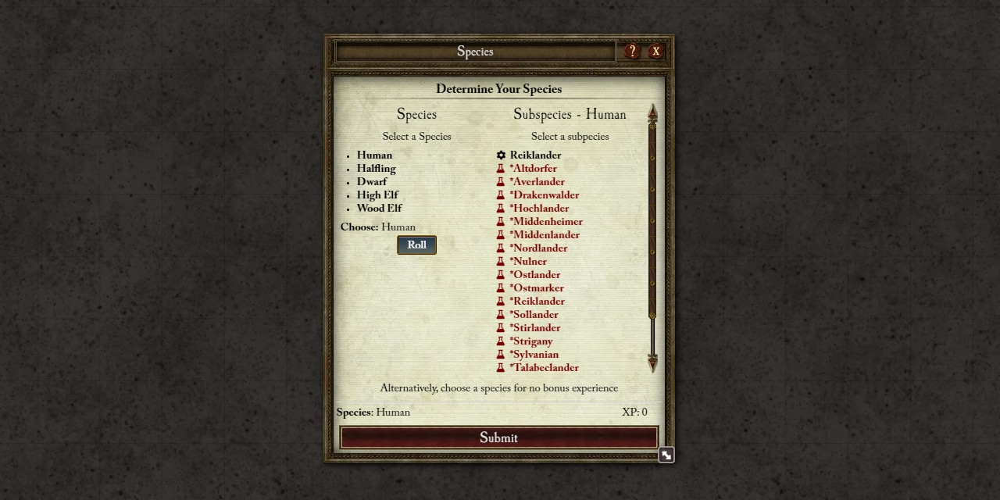
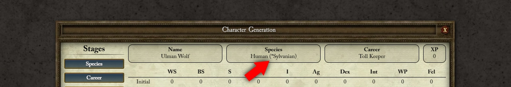

# WFRP4E: More Subspecies

This module adds a collection of new homebrew subspecies to choose from in the WFRP4E character generation.

# Supported species

At the moment, the module supports the following human subspecies:

- Imperial Humans
- Bretonnian Humans
- Kislevite Humans

All subspecies added by this module are prefixed with `*`.

## Source Data

You can find more information about each subspecies skills and talents in this [Google Sheet](https://docs.google.com/spreadsheets/d/1SU834rU3BHtLv57bYg7TLZKWghYfZ5KHy2GjJ9fHbno/edit#gid=0).

This homebrew compilation was based on this [Google Sheet](https://docs.google.com/spreadsheets/d/1ehSmNG95dfgvZm1PxrzC5gCiPzBIbq2VwllN-APT3kc/edit#gid=0) that I found online and later refined to use in my groups. If you are the original author, please reach out so I can give you proper attribution for your work.

## Contributions

If you have suggestions please [open an issue](https://github.com/mcavallo/foundry-vtt-wfrp4e-more-subspecies/issues/new).

# Installation / Usage

1. Install the package following the [standard Foundry procedure](https://foundryvtt.wiki/en/basics/Modules).
2. Go to the [module settings](https://github.com/mcavallo/foundry-vtt-wfrp4e-more-subspecies/wiki/Settings#enabled-datasets) and choose the subspecies you want to allow in your game.

# Settings

The module has a settings page that you can use to customize the experience to your liking. Read more about it [here](https://github.com/mcavallo/foundry-vtt-random-target/wiki/Settings).

# Support the Project

Please consider [supporting me](https://www.buymeacoffee.com/ikindred) if you find this module useful.

